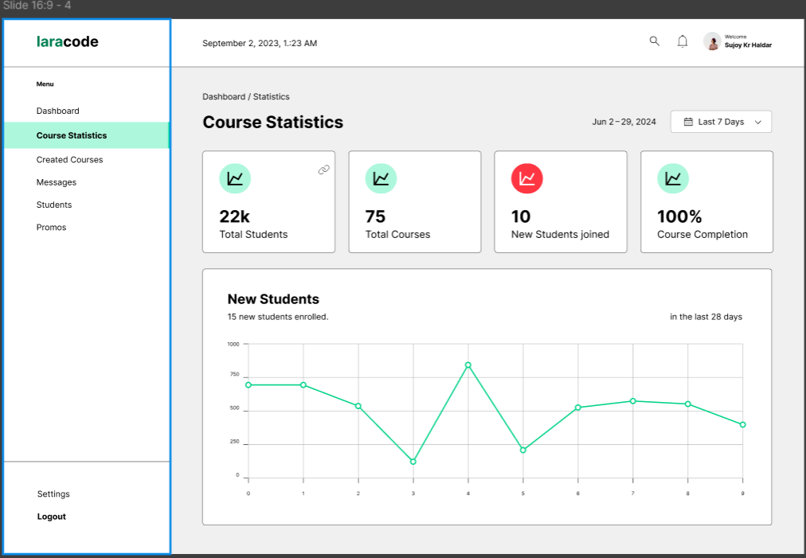
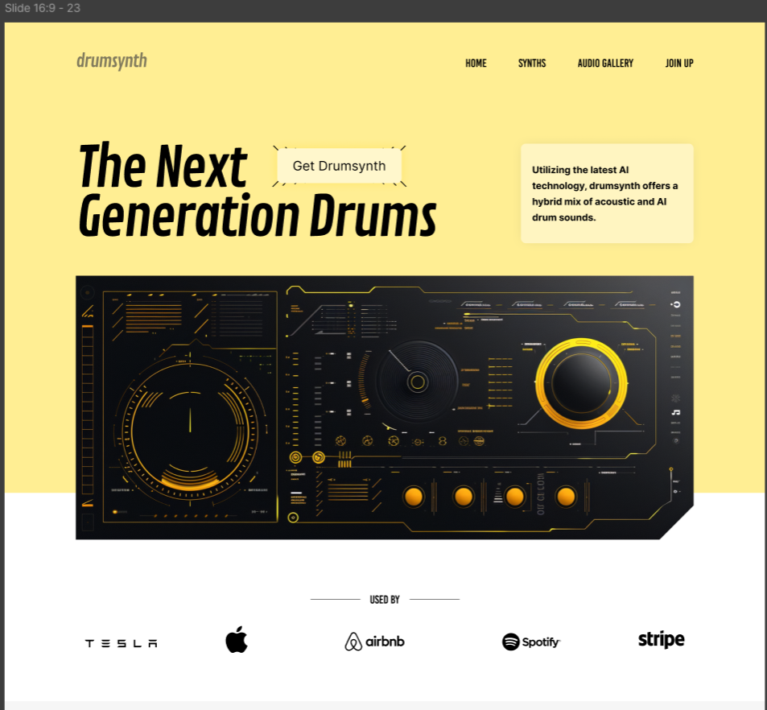
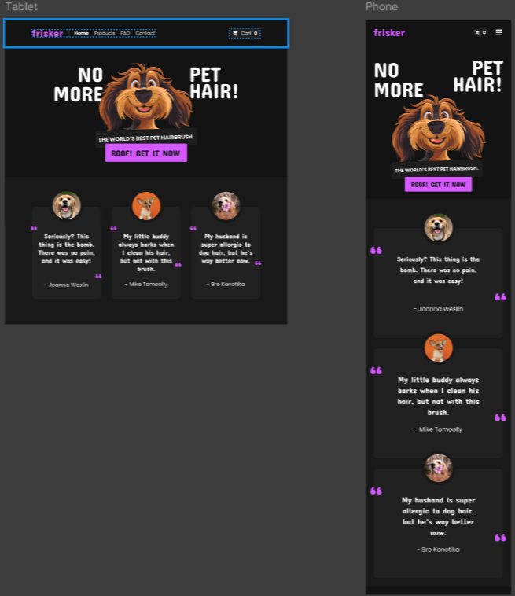

# 🌟 30 Days UI/UX Design Challenge

This repository contains my personal take on the **30 Days UI/UX Design Challenge** inspired by the [DesignCourse](https://www.youtube.com/@DesignCourse/playlists) channel. Each design is crafted with Figma and demonstrates various UI patterns and design principles.

---

## 📁 Designs Included

- ✅ Card UI
- ✅ Dashboard Design
- ✅ Form Design
- ✅ Hero Section
- ✅ Responsive Design Layouts
- ✅ Light and Dark Mode Navbars

---

## 📸 Screenshots

Below are some previews of the designs:

### ✨ Dashboard UI

### 💳 Hero Section UI

### 💳 Responsive Design UI

---

## 🎨 Tools Used

- Figma
- Inspiration: DesignCourse YouTube Channel

---

## 📌 Note

These designs are for learning and portfolio purposes only and were made while following along with the **30 Day UI/UX Challenge** video series. They are not intended for commercial use.

---

## 🧠 Author

- GitHub: [@Itshari2005](https://github.com/Itshari2005)
- Email: [hariprashath220305@gmail.com](mailto:hariprashath220305@gmail.com)

